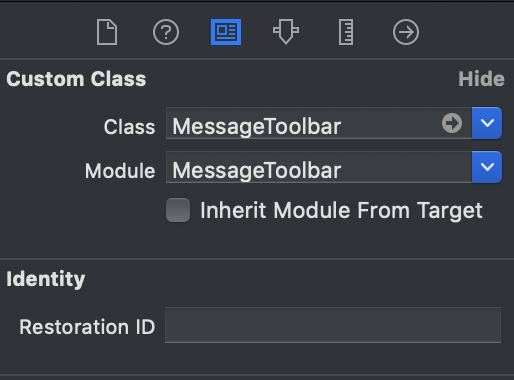
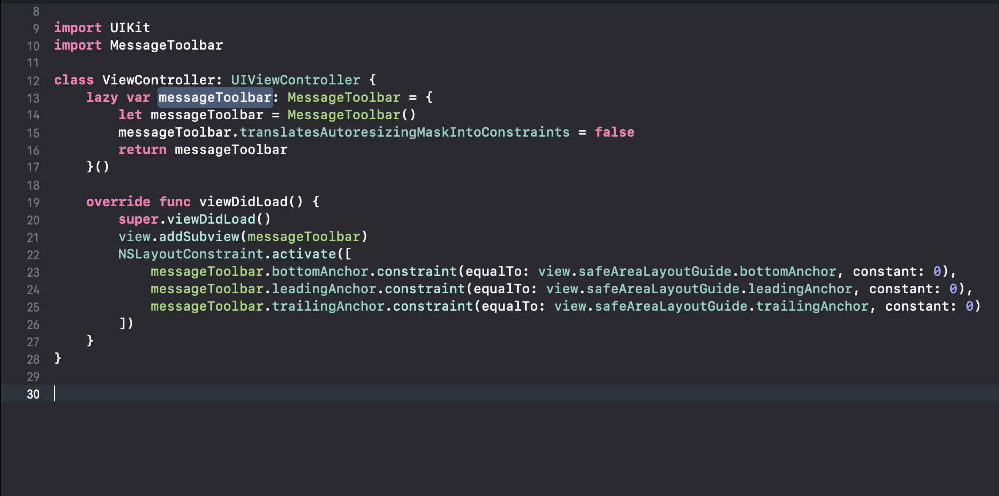

# MessageToolbar

MessageToolbar is an elegant drop-in message toolbar for your chat modules (or anything that uses message toolbars !).

MessageToolbar supports receiving the following inputs from users:

* Text Input
* Image Input
* Voice Input (With an animation that looks kinda like whatsapp !)

In short, it exposes certain protocol methods which delivers the data input from your users with zero effort.

If you end up using MessageToolbar in production, I'd love to hear from you. You can reach me through [email](mailto:tareksabry444@outlook.com)

## Installation

### CocoaPods

To integrate Cartography into your Xcode project using CocoaPods, specify it in your `Podfile`:

```ruby
target '<Your Target Name>' do
  pod 'MessageToolbar', '~> 1.0.0'
end
```

Then, run the following command:

```bash
$ pod install
```

### Without CocoaPods

Copy the `MessageToolbar/` directory to your project and install all dependencies.

## Usage

Drag and drop an `UIView` object into your view controller and set its class and module to `MessageToolbar`.



_Note: MessageToolbar does not require explicit height you can safely ignore the height error at storyboard it'll be resolved at runtime (Does anyone still use storyboards at this point anyway?)_

Or just instantiate it in the code directly.



Unforutantely MessageToolbar does not support Interface Builder properties (Yet !) but it will be included in future versions. However there are few attributes you can customize in code directly

### Supported Attributes

| Attribute        | Description      | Default value  |
| ------------- |-------------| -----|
| pickImageButton      | The image for the image picker button     | An image that comes bundled with the pod |
| recordVoiceButtonImage     | The image for the voice recorder button     | An image that comes bundled with the pod |
| disabledSendButtonImage      | The image for the send button when there's no user input     | An image that comes bundled with the pod |
| enabledSendButtonImage     | The image for the send button when the user writes something in the textview     | An image that comes bundled with the pod |
| micIconImage      | The image that will be fading in / out during voice recording    | An image that comes bundled with the pod |
| enablePhotoPicking      | Whether the message toolbar should enable or disable photo picking feature     | true |
| enableVoiceRecord      | Whether the message toolbar should enable or disable voice recording feature     | true |
| voiceRecordDuration      | The duration desired for the voice recorder (in seconds).     | 10.0 |
| setBackgroundColor      | Sets the container view background color     | UIColor(red: 250/255, green: 250/255, blue: 250/255, alpha: 1.0) |

## Delegate Conformance

Once you have created your MessageToolbar whether it's in storyboard or programmatically 
Just set MessageToolbar's delegate to self

```Swift
messageToolbar.delegate = self
```

You have to conform to MessageToolbarDelegate which comes with handy-dandy methods and gives you full control over the user input.

```Swift
@objc public protocol MessageToolbarDelegate: class {
    
    @objc optional func didFinish(picking image: UIImage)
    @objc optional func didDenyPhotoLibraryPermission()
    @objc optional func didCancelPhotoPicking()
    
    @objc optional func didFinish(recording voice: Data)
    @objc optional func didFailToRecord()
    @objc optional func didDenyMicPermission()
    @objc optional func didCancelRecord()
    
    func didSend(message: String)
}
```

You can conform to whatever suits you since it's an optional protocol. (No polluted classes with unused protocol methods, Yay!).

## Required Permissions

In order for MessageToolbar to behave correctly it requires two permissions

* NSMicrophoneUsageDescription
* NSPhotoLibraryUsageDescription

I could have added them internally but I left it out so you can customize your own messages

_Note: If you don't supply these permissions your application will simple crash upon performing anything sensitive I.E accessing user's gallery / trying to record microphone so feel free to ask the user for permissions whenever you want to just before using MessageToolbar_

## **Example project**
  * Clone the repo using `git clone https://github.com/tareksabry1337/MessageToolbar`
  * Navigate to Example folder
  * Run `pod install`
  * Open MessageToolbarExample.xcworkspace
  * Hit Command + R to run the demo

## Requirements

* iOS 10.0+
* Xcode 10.1+
* Swift 4.2+

## About MessageToolbar

MessageToolbar was built by me -Obviously..-, Initially I just wanted to encapuslate all of this logic into a framework for future usage since the code was going to be reused a lot. And I figured why the heck not ? So I decided to deliver it via Cocoapods for everyone to use (Because boilerplate code is boring am I right ?)

Also MessageToolbar is built completely in code, no Xibs / no Storyboards. It's highly flexible and can be customized easily with minimum effort.


## Support

Please, don't hesitate to [file an
issue](https://github.com/tareksabry1337/MessageToolbar/issues/new) if you have questions.


## Dependncies
MessageToolbar depends mainly on two things

The awesome GrowingTextView from [Kenneth Tsang][GrowingTextView]<br>
The Shimmer pod from [Facebook][Shimmer]

[GrowingTextView]:            https://github.com/KennethTsang/GrowingTextView
[Shimmer]:            https://github.com/facebook/Shimmer

Everything else was built from scratch natively and using Swift's Modern APIs

## License

MessageToolbar is released under the MIT license. [See LICENSE](https://github.com/tareksabry1337/MessageToolbar/blob/master/LICENSE) for details.
